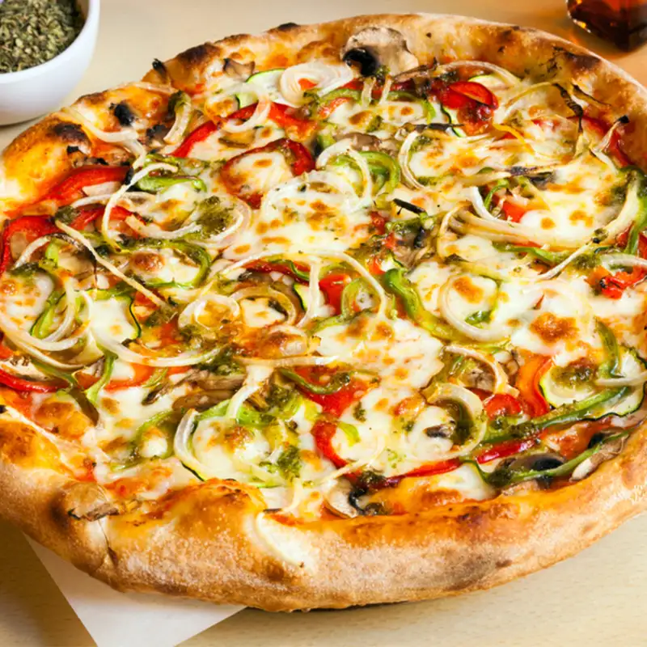

<!DOCTYPE html>
<html lang="hi">
<head>
<meta charset="UTF-8">
<meta name="viewport" content="width=device-width, initial-scale=1.0">

<title>बाजार जैसा पिज्जा घर पर कैसे बनाएं?</title>

<meta name="description" content="घर पर बाजार जैसा चीज़ी और क्रिस्पी पिज्जा बनाने की आसान रेसिपी। बिना ओवन के स्वादिष्ट वेज पिज्जा बनाएं।">

<meta name="keywords" content="बाजार जैसा पिज्जा, Pizza Recipe in Hindi, Homemade Pizza Recipe, Street Style Pizza, Veg Pizza Recipe, Cheese Pizza Recipe">

</head>

<body>

<h1>🍕 बाजार जैसा पिज्जा घर पर कैसे बनाएं?</h1>

अगर आप भी बाहर मिलने वाले चीज़ी, क्रिस्पी और टेस्टी पिज्जा के दीवाने हैं,
तो यह रेसिपी आपके लिए है। इस आसान विधि से आप घर पर ही बाजार जैसा
स्वादिष्ट पिज्जा बना सकते हैं। इसमें मिलेगा सॉफ्ट बेस,
मसालेदार टॉपिंग और खूब सारा चीज़ी फ्लेवर, जो हर किसी को पसंद आएगा।

<!-- Image 1 -->

<h2>⏰ बनाने का समय</h2>

<table>

<tr>
<th>तैयारी</th>
<th>पकाने का समय</th>
<th>कुल समय</th>
<th>सर्विंग</th>
</tr>

<tr>
<td>15 मिनट</td>
<td>20 मिनट</td>
<td>35 मिनट</td>
<td>2–3 लोगों के लिए</td>
</tr>

</table>

<h2>🛒 आवश्यक सामग्री</h2>

<h3>पिज्जा बेस के लिए</h3>

<ul>

<li>2 कप मैदा</li>
<li>1 छोटा चम्मच चीनी</li>
<li>1 छोटा चम्मच नमक</li>
<li>1 छोटा चम्मच यीस्ट</li>
<li>1 बड़ा चम्मच तेल</li>
<li>¾ कप गुनगुना पानी</li>

</ul>

<!-- Image 2 -->

<h3>टॉपिंग के लिए</h3>

<ul>

<li>1 मध्यम प्याज (स्लाइस किया हुआ)</li>
<li>1 शिमला मिर्च (स्लाइस की हुई)</li>
<li>1 टमाटर (स्लाइस किया हुआ)</li>
<li>½ कप स्वीट कॉर्न</li>
<li>½ कप मशरूम (वैकल्पिक)</li>
<li>1 कप कद्दूकस किया हुआ मोज़रेला चीज़</li>
<li>2 बड़े चम्मच पिज्जा सॉस</li>
<li>1 छोटा चम्मच चिली फ्लेक्स</li>
<li>1 छोटा चम्मच ऑरेगैनो</li>
<li>1 छोटा चम्मच काली मिर्च</li>
<li>1 छोटा चम्मच मक्खन</li>
<li>नमक स्वादानुसार</li>

</ul>

<h2>👨‍🍳 बनाने की विधि</h2>

<ol>

<li>
सबसे पहले एक बाउल में मैदा, नमक, चीनी और यीस्ट डालें।
अब इसमें गुनगुना पानी और तेल मिलाकर नरम आटा गूंथ लें।
आटे को ढककर 1 घंटे के लिए रख दें ताकि वह फूल जाए।
</li>

<li>
जब आटा तैयार हो जाए, तो उसे हल्का सा मसलकर
पिज्जा बेस की तरह बेल लें।
</li>

<li>
अब एक पैन या तवे को हल्का सा तेल या मक्खन लगाकर
गर्म करें और बेस को दोनों तरफ से हल्का सुनहरा होने तक सेक लें।
</li>

<li>
अब बेस पर पिज्जा सॉस अच्छी तरह फैलाएं।
</li>

<li>
इसके ऊपर प्याज, शिमला मिर्च, टमाटर,
स्वीट कॉर्न और मशरूम डालें।
</li>

<li>
ऊपर से भरपूर मात्रा में मोज़रेला चीज़ डालें।
</li>

<li>
अब चिली फ्लेक्स, ऑरेगैनो, काली मिर्च और नमक छिड़कें।
</li>

<li>
पैन को ढककर धीमी आंच पर 8–10 मिनट तक पकाएं
जब तक चीज़ पूरी तरह पिघल न जाए और बेस क्रिस्पी न हो जाए।
</li>

<li>
गरमा-गरम स्लाइस करके सर्व करें।
</li>

</ol>

<!-- Image 3 -->

<h2>⭐ बाजार जैसा स्वाद पाने के आसान टिप्स</h2>

<ul>

<li>आटा अच्छी तरह गूंथें ताकि बेस मुलायम बने।</li>

<li>चीज़ की मात्रा थोड़ी ज्यादा रखें।</li>

<li>टॉपिंग ज्यादा न पकाएं ताकि उनका क्रंच बना रहे।</li>

<li>घर का बना टमाटर सॉस भी इस्तेमाल कर सकते हैं।</li>

<li>ऊपर से पेरी-पेरी मसाला डालने से स्वाद और बढ़ जाता है।</li>

</ul>

<h2>❓ अक्सर पूछे जाने वाले सवाल (FAQs)</h2>

<h3>1. क्या बिना ओवन के बाजार जैसा पिज्जा बन सकता है?</h3>

हाँ, आप इसे तवे या पैन में आसानी से बना सकते हैं।

<h3>2. क्या रेडीमेड पिज्जा बेस इस्तेमाल कर सकते हैं?</h3>

हाँ, समय कम होने पर रेडीमेड बेस इस्तेमाल कर सकते हैं।

<h3>3. क्या इसे और ज्यादा चीज़ी बनाया जा सकता है?</h3>

हाँ, ऊपर से चीज़ की डबल लेयर डालने से यह और भी स्वादिष्ट बन जाता है।

<h2>📌 निष्कर्ष</h2>

अगर आप घर पर कम समय में बाजार जैसा स्वादिष्ट पिज्जा बनाना चाहते हैं,
तो यह रेसिपी जरूर ट्राई करें। इसका चीज़ी, क्रिस्पी और मसालेदार स्वाद
बच्चों से लेकर बड़ों तक सभी को पसंद आएगा।
अगर आपको यह रेसिपी पसंद आई हो,
तो इसे अपने दोस्तों और परिवार के साथ जरूर साझा करें।

<h2>SEO Keywords</h2>

बाजार जैसा पिज्जा,
Pizza Recipe in Hindi,
Homemade Pizza Recipe,
Street Style Pizza,
Veg Pizza Recipe,
Pizza Banane Ki Vidhi,
Easy Pizza Recipe,
Cheese Pizza Recipe

<footer>

© 2026 Shubham | All Rights Reserved

</footer>

</body>
</html>
